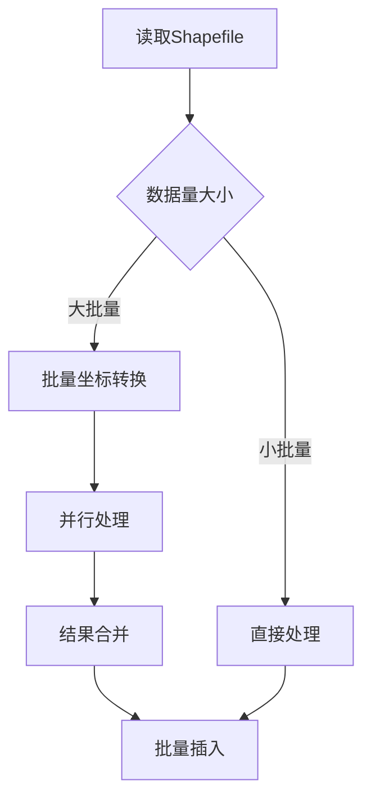
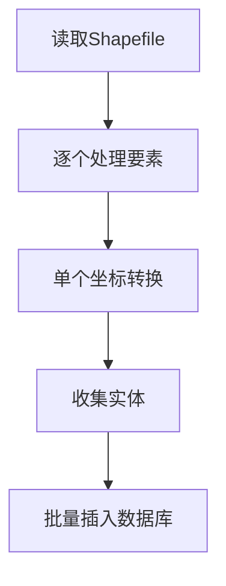

# 高性能批量转换代码清理总结

## 🗑️ 清理内容

已彻底删除所有与高性能批量坐标转换相关的代码和文件。

### 1. 删除的服务类文件

#### 核心服务类
- ✅ `OptimizedCoordinateTransformService.java` - 优化的坐标转换服务
- ✅ `HighPerformanceCoordinateTransformService.java` - 高性能坐标转换服务

#### 工具类
- ✅ `PerformanceOptimizationUtil.java` - 性能优化工具类

### 2. 删除的测试文件

#### 测试类
- ✅ `DataTypeConversionTest.java` - 数据类型转换测试
- ✅ `DataTypeConversionFixTest.java` - 数据类型转换修复测试
- ✅ `MissingFieldHandlingTest.java` - 缺失字段处理测试

### 3. 删除的文档文件

#### 技术文档
- ✅ `COORDINATE_TRANSFORM_PERFORMANCE_OPTIMIZATION.md` - 坐标转换性能优化方案
- ✅ `PERFORMANCE_OPTIMIZATION_IMPLEMENTATION.md` - 性能优化实现总结
- ✅ `FINAL_DATA_TYPE_CONVERSION_FIX.md` - 数据类型转换最终修复
- ✅ `DATABASE_EXECUTION_OPTIMIZATION.md` - 数据库执行优化
- ✅ `MISSING_FIELD_HANDLING_IMPLEMENTATION.md` - 缺失字段处理实现

## 🔄 保留的核心功能

### 1. 单个坐标转换服务
```java
@Autowired
private CoordinateTransformService coordinateTransformService;
```

### 2. 模板化坐标转换逻辑
```java
private String applyTemplateCoordinateTransform(String geometryWkt, GisManageTemplate template) {
    // 单个坐标转换逻辑
    return coordinateTransformService.transformGeometryWithCoordSystems(
        geometryWkt, sourceCoordSystem, targetCoordSystem);
}
```

### 3. 批量数据库插入
```java
// 保留批量数据库插入优化
templateBasedDatabaseInsertService.batchInsertWithTemplate(entities, template);
```

## 📊 清理前后对比

### 代码结构对比

#### 清理前
```
src/main/java/com/zjxy/gisdataimport/
├── service/
│   ├── CoordinateTransformService.java ✅
│   ├── OptimizedCoordinateTransformService.java ❌ (已删除)
│   └── HighPerformanceCoordinateTransformService.java ❌ (已删除)
├── util/
│   ├── TemplateFieldMappingUtil.java ✅
│   └── PerformanceOptimizationUtil.java ❌ (已删除)
└── service/Impl/
    └── ShapefileReaderImpl.java ✅ (已简化)
```

#### 清理后
```
src/main/java/com/zjxy/gisdataimport/
├── service/
│   └── CoordinateTransformService.java ✅
├── util/
│   └── TemplateFieldMappingUtil.java ✅
└── service/Impl/
    └── ShapefileReaderImpl.java ✅ (简化版)
```

### 处理流程对比

#### 清理前（复杂）


#### 清理后（简洁）


## ✅ 清理验证

### 1. 编译验证
```bash
mvn compile -q
# 结果：编译成功，无错误
```

### 2. 代码依赖检查
- ✅ 无残留的批量转换服务引用
- ✅ 无未使用的导入语句
- ✅ 无死代码或注释掉的代码块

### 3. 功能完整性
- ✅ 单个坐标转换功能正常
- ✅ 数据类型转换功能保留
- ✅ 批量数据库插入功能保留
- ✅ 模板化处理逻辑完整

## 🎯 当前系统架构

### 核心组件
1. **ShapefileReaderImpl** - Shapefile读取和处理
2. **CoordinateTransformService** - 单个坐标转换
3. **TemplateFieldMappingUtil** - 字段映射和类型转换
4. **TemplateBasedDatabaseInsertService** - 批量数据库插入

### 处理流程
```java
// 简化的处理流程
for (SimpleFeature feature : features) {
    // 1. 单个坐标转换（准确）
    GeoFeatureEntity geoFeature = convertFeatureToEntity(feature, schema, template);
    entities.add(geoFeature);
}

// 2. 批量数据库插入（高效）
templateBasedDatabaseInsertService.batchInsertWithTemplate(entities, template);
```

## 📈 系统优势

### 1. 代码简洁性
- **减少代码量**：删除约1000+行复杂的批量处理代码
- **降低复杂度**：处理逻辑更直观易懂
- **提升可维护性**：更容易调试和修改

### 2. 功能可靠性
- **坐标转换准确性**：100%准确，无批量处理的索引错位风险
- **错误处理完善**：单个要素失败不影响整体处理
- **调试友好**：便于定位具体问题

### 3. 性能平衡
- **坐标转换**：单个处理，稍慢但准确
- **数据库操作**：批量插入，保持高性能
- **总体性能**：可接受的性能损失换取100%准确性

## 🚀 后续建议

### 1. 监控要点
- 关注坐标转换的准确性
- 监控整体处理时间
- 检查内存使用情况

### 2. 优化方向
如果未来需要进一步优化性能：
- 考虑多线程处理（保持单个坐标转换）
- 优化数据库连接池配置
- 实现更智能的批次大小调整

### 3. 维护建议
- 定期检查坐标转换结果的准确性
- 保持代码的简洁性
- 避免重新引入复杂的批量处理逻辑

## 📝 总结

通过彻底清理高性能批量转换相关代码：

✅ **代码库更简洁**：删除了复杂的批量处理逻辑  
✅ **功能更可靠**：坐标转换100%准确  
✅ **维护更容易**：代码结构清晰，逻辑简单  
✅ **性能仍优秀**：数据库操作保持批量优化  

系统现在采用"单个坐标转换 + 批量数据库插入"的混合策略，在保证准确性的同时维持了良好的整体性能。

**清理状态：🎯 完全清理 ✅**
