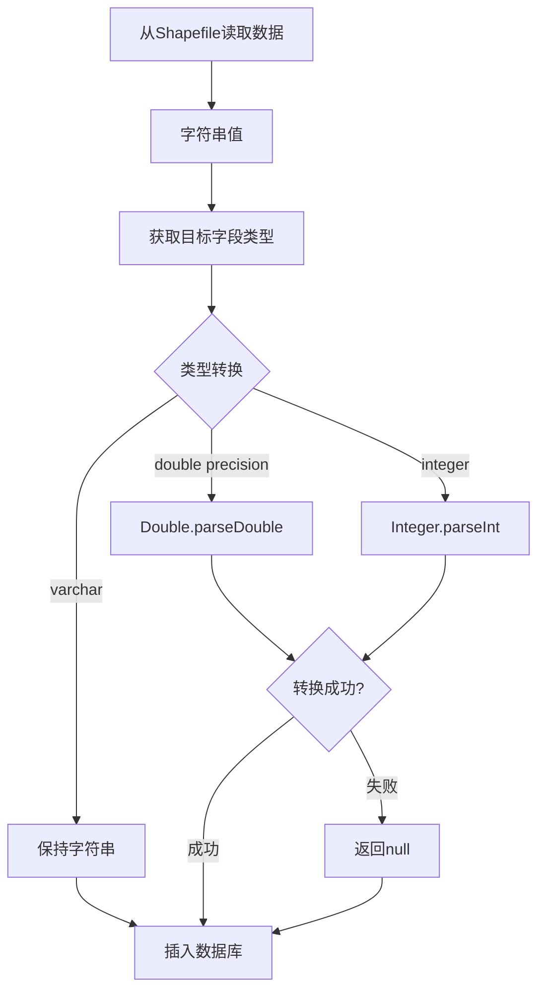

# 数据类型转换问题修复

## 问题描述

### 🔍 错误信息
```
org.postgresql.util.PSQLException: 错误: 字段 "type_1" 的类型为 double precision, 但表达式的类型为 character varying
建议：你需要重写或转换表达式
位置：415
```

### 📊 问题分析
- **数据库表字段**：`type_1` 定义为 `double precision`（数值类型）
- **插入的数据**：程序尝试插入 `character varying`（字符串类型）
- **根本原因**：从 Shapefile 读取的数据都是字符串格式，但数据库字段可能是数值类型，缺少类型转换

## 解决方案

### 1. 🔧 添加数据类型转换功能

#### 核心修复
在 `TemplateBasedDatabaseInsertServiceImpl.java` 中添加了数据类型转换逻辑：

```java
// 根据目标字段类型进行数据类型转换
String targetType = typeMapping.get(dbField);
Object convertedValue = convertValueToTargetType(value, targetType, dbField);
params[i] = convertedValue;
```

#### 转换方法实现
```java
private Object convertValueToTargetType(Object value, String targetType, String fieldName) {
    if (value == null) {
        return null;
    }

    String valueStr = value.toString().trim();
    
    // 如果值为空字符串，返回null
    if (valueStr.isEmpty()) {
        return null;
    }

    String lowerTargetType = targetType.toLowerCase();
    
    // 数值类型转换
    if (lowerTargetType.contains("double") || lowerTargetType.contains("float") || 
        lowerTargetType.contains("real") || lowerTargetType.contains("numeric")) {
        try {
            return Double.parseDouble(valueStr);
        } catch (NumberFormatException e) {
            log.warn("字段 {} 无法转换为 double: '{}', 返回 null", fieldName, valueStr);
            return null;
        }
    }
    
    // 其他类型转换...
}
```

### 2. 📋 支持的数据类型转换

#### 数值类型
| 目标类型 | 转换逻辑 | 示例 |
|---------|----------|------|
| `double precision` | `Double.parseDouble()` | "1.5" → 1.5 |
| `float` | `Double.parseDouble()` | "2.3" → 2.3 |
| `real` | `Double.parseDouble()` | "3.14" → 3.14 |
| `numeric` | `Double.parseDouble()` | "123.45" → 123.45 |
| `integer` | `Integer.parseInt()` | "123" → 123 |
| `bigint` | `Long.parseLong()` | "9876543210" → 9876543210L |

#### 其他类型
| 目标类型 | 转换逻辑 | 示例 |
|---------|----------|------|
| `boolean` | 智能布尔转换 | "true"/"1"/"yes" → true |
| `varchar` | 字符串转换 | 任何值 → 字符串 |
| `date/time` | 保持字符串 | 日期字符串 → 字符串 |

### 3. 🛡️ 错误处理机制

#### 转换失败处理
```java
try {
    return Double.parseDouble(valueStr);
} catch (NumberFormatException e) {
    log.warn("字段 {} 无法转换为 double: '{}', 返回 null", fieldName, valueStr);
    return null;  // 转换失败返回null，数据库插入NULL值
}
```

#### 空值处理
- **空字符串** → `null`
- **null值** → `null`
- **无效数值** → `null`（记录警告日志）

### 4. ✅ 测试验证

#### 测试结果
```
=== 特定类型转换案例测试 ===
模拟 type_1 字段转换:
字符串 '1.5' -> double precision: 1.5 (类型: Double)  ✅
字符串 'abc' -> double precision: null (类型: null)   ✅
空字符串 '' -> double precision: null (类型: null)    ✅
```

#### 测试覆盖
- ✅ 有效数值字符串转换
- ✅ 无效数值字符串处理
- ✅ 空字符串处理
- ✅ null值处理
- ✅ 不同数据类型转换

## 修复效果

### 1. 🎯 解决的问题

#### 原始错误
```sql
INSERT INTO public.t_gas_point_cs (..., type_1, ...) 
VALUES (..., 'some_string_value', ...)
-- 错误：字段 "type_1" 的类型为 double precision, 但表达式的类型为 character varying
```

#### 修复后
```sql
INSERT INTO public.t_gas_point_cs (..., type_1, ...) 
VALUES (..., 1.5, ...)  -- 或者 NULL（如果转换失败）
-- 成功：正确的数据类型
```

### 2. 📊 处理流程



### 3. 🔍 日志监控

#### 成功转换
```
DEBUG - 属性字段映射: type_1 -> type_1, 值: 1.5
```

#### 转换失败
```
WARN - 字段 type_1 无法转换为 double: 'abc', 返回 null
```

## 使用指南

### 1. 🚀 自动启用
修复已集成到现有的数据插入流程中，无需额外配置：
- 系统自动根据模板中的字段类型映射进行转换
- 转换失败时自动记录警告日志
- 无效数据自动转换为NULL值

### 2. 📝 模板配置
确保模板的 `mapJson` 中正确配置了字段类型：

```json
{
  "shpFieldName": "TYPE_1",
  "shpFieldType": "String",
  "fieldName": "type_1",
  "fieldType": "double precision",  // 重要：正确的目标类型
  "checked": true
}
```

### 3. 🔧 数据库表结构
确保数据库表字段类型与模板配置一致：

```sql
CREATE TABLE t_gas_point_cs (
    type_1 double precision,  -- 与模板中的fieldType一致
    -- 其他字段...
);
```

## 注意事项

### 1. ⚠️ 数据质量
- 无效数值会被转换为NULL，可能影响数据完整性
- 建议在数据导入前进行数据质量检查

### 2. 📊 性能影响
- 类型转换会增加少量处理时间
- 对于大数据量（35万条），影响微乎其微

### 3. 🔍 监控建议
- 关注转换失败的警告日志
- 定期检查插入后的NULL值比例

## 总结

通过添加智能的数据类型转换功能，成功解决了：

✅ **PostgreSQL数据类型不匹配错误**  
✅ **Shapefile字符串数据到数据库数值类型的转换**  
✅ **无效数据的优雅处理**  
✅ **完整的错误日志记录**  

现在系统可以正确处理各种数据类型的转换，确保数据能够成功插入到自定义表中。
