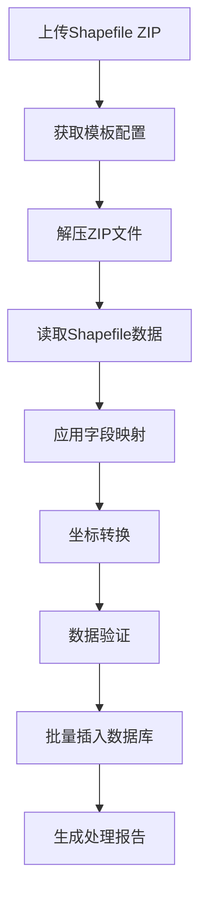

# 基于模板的Shapefile数据导入指南

## 📋 概述

本指南介绍如何在 `gis-data-import` 项目中使用 `GisManageTemplate` 模板功能，实现配置化的Shapefile数据导入。

## 🎯 核心功能

### 1. **模板驱动的数据导入**
- 通过配置模板定义字段映射关系
- 支持坐标系转换配置
- 灵活的数据验证规则
- 多种几何类型支持（点、线、面）

### 2. **配置化处理流程**
- 无需修改代码即可支持新的数据格式
- 统一的数据处理标准
- 可重用的模板配置

## 🚀 快速开始

### 1. **数据库初始化**

首先执行SQL脚本创建模板表：

```sql
-- 执行 src/main/resources/sql/gis_manage_template.sql
source src/main/resources/sql/gis_manage_template.sql;
```

### 2. **创建模板配置**

#### 2.1 **点要素模板示例**

```json
{
  "tableName": "geo_features",
  "nameZh": "城市POI点模板",
  "nameEn": "City POI Template",
  "type": 2,
  "isZh": true,
  "originalCoordinateSystem": "CGCS2000",
  "targetCoordinateSystem": "CGCS2000XY",
  "templateType": "shp",
  "dataBase": "gisdb",
  "inOrOut": "in",
  "map": [
    {
      "shpFieldName": "NAME",
      "fieldName": "poi_name",
      "dataType": "String",
      "required": true,
      "description": "POI名称"
    },
    {
      "shpFieldName": "TYPE",
      "fieldName": "poi_type",
      "dataType": "String",
      "required": false,
      "description": "POI类型"
    },
    {
      "shpFieldName": "ADDRESS",
      "fieldName": "address",
      "dataType": "String",
      "required": false,
      "description": "地址"
    },
    {
      "shpFieldName": "the_geom",
      "fieldName": "geometry",
      "dataType": "Geometry",
      "required": true,
      "coordinateTransform": true,
      "description": "几何数据"
    }
  ]
}
```

#### 2.2 **线要素模板示例**

```json
{
  "tableName": "road_network",
  "nameZh": "道路网络模板",
  "nameEn": "Road Network Template",
  "type": 3,
  "isZh": true,
  "originalCoordinateSystem": "CGCS2000",
  "targetCoordinateSystem": "WenZhou2000",
  "templateType": "shp",
  "dataBase": "gisdb",
  "inOrOut": "in",
  "map": [
    {
      "shpFieldName": "ROAD_NAME",
      "fieldName": "road_name",
      "dataType": "String",
      "required": true,
      "description": "道路名称"
    },
    {
      "shpFieldName": "ROAD_TYPE",
      "fieldName": "road_type",
      "dataType": "String",
      "required": true,
      "description": "道路类型"
    },
    {
      "shpFieldName": "ROAD_LEVEL",
      "fieldName": "road_level",
      "dataType": "Integer",
      "required": false,
      "description": "道路等级"
    },
    {
      "shpFieldName": "the_geom",
      "fieldName": "geometry",
      "dataType": "Geometry",
      "required": true,
      "coordinateTransform": true,
      "description": "几何数据"
    }
  ]
}
```

### 3. **API使用示例**

#### 3.1 **创建模板**

```bash
curl -X POST http://localhost:8080/api/template-shapefile/templates \
  -H "Content-Type: application/json" \
  -d '{
    "tableName": "geo_features",
    "nameZh": "测试模板",
    "type": 2,
    "isZh": true,
    "originalCoordinateSystem": "CGCS2000",
    "targetCoordinateSystem": "CGCS2000XY",
    "templateType": "shp",
    "dataBase": "gisdb",
    "map": [...]
  }'
```

#### 3.2 **使用模板导入数据**

```bash
# 上传文件并使用模板处理
curl -X POST http://localhost:8080/api/template-shapefile/upload-with-template \
  -F "file=@/path/to/your/shapefile.zip" \
  -F "templateId=1"

# 从路径使用模板处理
curl -X POST http://localhost:8080/api/template-shapefile/process-with-template \
  -F "filePath=/path/to/your/shapefile.zip" \
  -F "templateId=1"
```

#### 3.3 **查询模板**

```bash
# 获取所有导入模板
curl -X GET http://localhost:8080/api/template-shapefile/templates

# 根据ID获取模板详情
curl -X GET http://localhost:8080/api/template-shapefile/templates/1

# 根据几何类型获取模板
curl -X GET http://localhost:8080/api/template-shapefile/templates/by-geometry-type/2
```

## 🔧 配置说明

### 1. **模板字段说明**

| 字段名 | 类型 | 必填 | 说明 |
|--------|------|------|------|
| tableName | String | 是 | 目标数据库表名 |
| nameZh | String | 是 | 模板中文名称 |
| type | Integer | 是 | 几何类型：1纯文本，2点表，3线表 |
| isZh | Boolean | 否 | 是否进行坐标转换 |
| originalCoordinateSystem | String | 否 | 源坐标系 |
| targetCoordinateSystem | String | 否 | 目标坐标系 |
| map | Array | 是 | 字段映射配置 |

### 2. **字段映射配置**

| 字段名 | 类型 | 必填 | 说明 |
|--------|------|------|------|
| shpFieldName | String | 是 | Shapefile中的字段名 |
| fieldName | String | 是 | 数据库中的字段名 |
| dataType | String | 是 | 数据类型：String, Integer, Double, Geometry等 |
| required | Boolean | 否 | 是否必填 |
| coordinateTransform | Boolean | 否 | 是否需要坐标转换（仅几何字段） |
| description | String | 否 | 字段描述 |

### 3. **坐标系配置**

支持的坐标系包括：
- CGCS2000：国家大地坐标系2000
- CGCS2000XY：CGCS2000投影坐标系
- WenZhou2000：温州2000坐标系
- Beijing1954：北京1954坐标系

## 📊 处理流程

### 1. **数据导入流程**



### 2. **错误处理机制**

- **字段映射错误**：记录错误信息，跳过该记录
- **坐标转换失败**：保留原始坐标，记录警告
- **数据验证失败**：根据配置决定是否跳过
- **数据库插入失败**：回滚事务，返回错误信息

## 🎯 最佳实践

### 1. **模板设计原则**

- **字段映射完整性**：确保所有必要字段都有映射
- **数据类型匹配**：Shapefile字段类型与数据库字段类型匹配
- **坐标系准确性**：确保源坐标系和目标坐标系配置正确
- **验证规则合理性**：设置合理的数据验证规则

### 2. **性能优化建议**

- **批量处理**：使用大批次处理提高性能
- **索引优化**：在目标表的关键字段上创建索引
- **内存管理**：处理大文件时注意内存使用
- **并发控制**：避免同时处理多个大文件

### 3. **错误排查**

- **查看日志**：检查应用日志中的错误信息
- **验证模板**：使用验证接口检查模板配置
- **测试数据**：使用小数据集测试模板配置
- **坐标转换**：验证坐标转换参数是否正确

## 🔍 故障排除

### 1. **常见问题**

#### Q: 坐标转换失败
A: 检查源坐标系和目标坐标系配置是否正确，确保坐标转换参数文件存在。

#### Q: 字段映射不生效
A: 检查Shapefile中的字段名是否与模板配置中的shpFieldName完全匹配（区分大小写）。

#### Q: 数据插入失败
A: 检查目标数据库表是否存在，字段类型是否匹配，数据库连接是否正常。

### 2. **调试技巧**

- 使用小数据集测试模板配置
- 启用详细日志记录
- 使用验证接口检查模板配置
- 检查数据库表结构和权限

## 📈 扩展功能

### 1. **自定义验证规则**

可以通过扩展 `GisManageTemplateValid` 表来添加自定义验证规则：

```sql
INSERT INTO gis_manage_template_valid (
  template_id, field_name, validation_type, validation_rule, error_message
) VALUES (
  1, 'poi_type', 'enum', 
  '{"values": ["餐饮", "购物", "娱乐", "教育", "医疗"]}', 
  'POI类型必须是预定义值之一'
);
```

### 2. **多数据源支持**

通过配置不同的 `dataBase` 字段，可以支持将数据导入到不同的数据库。

### 3. **批量模板管理**

可以通过Excel或JSON文件批量导入模板配置，提高配置效率。

这个基于模板的Shapefile导入系统为您提供了强大的配置化数据处理能力，既保持了系统的灵活性，又确保了数据处理的标准化和一致性。
